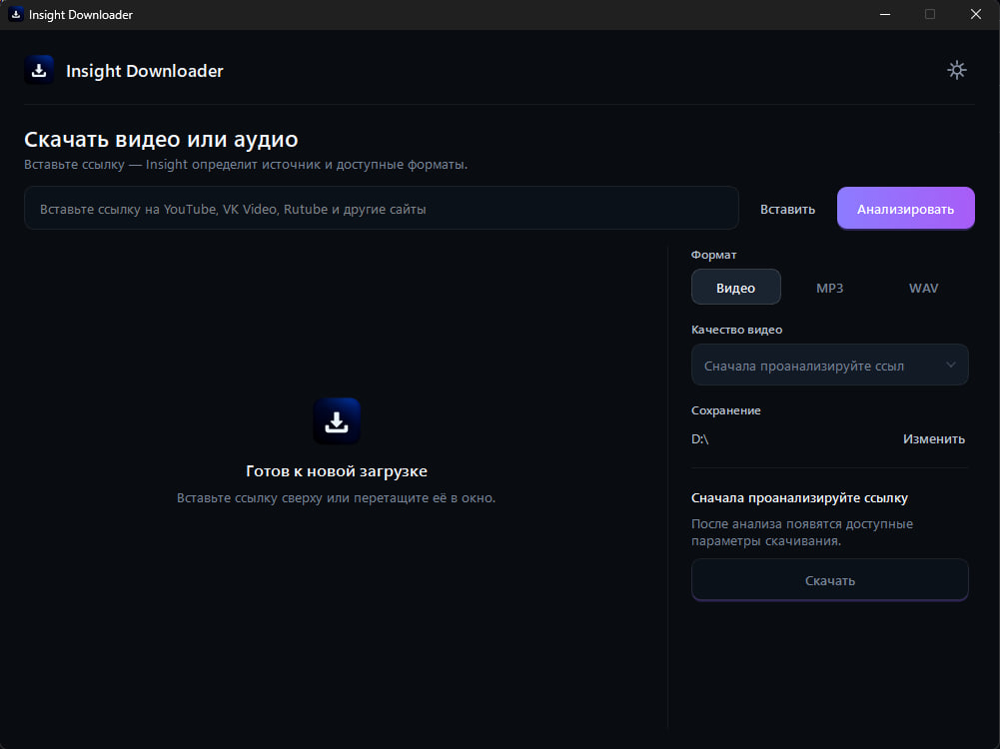

# Insight Downloader

**Insight Downloader** — бесплатное приложение для Windows для скачивания видео и аудио с YouTube, VK Видео, Rutube и множества других сайтов, поддерживаемых [yt-dlp](https://github.com/yt-dlp/yt-dlp).

Приложение позволяет скачивать видео в лучшем доступном качестве или сохранять аудио в MP3 и WAV через простой графический интерфейс — без командной строки и сложной ручной настройки.

> Текущая версия: **0.7.2**

---

## Возможности

- скачивание видео с YouTube, VK Видео, Rutube и других сайтов;
- поддержка большинства ресурсов, совместимых с yt-dlp;
- автоматический анализ ссылки перед скачиванием;
- скачивание видео в лучшем доступном качестве;
- извлечение аудио в **MP3** и **WAV**;
- выбор качества видео и аудио;
- вставка ссылки из буфера обмена;
- поддержка Drag & Drop;
- выбор папки для сохранения файлов;
- запоминание папки загрузок;
- автоматическая проверка обновлений;
- ручная проверка обновлений;
- системная, тёмная и светлая темы;
- встроенная диагностика необходимых компонентов;
- автоматическая подготовка необходимых runtime-компонентов.

---

## Интерфейс

Insight Downloader спроектирован как компактное Windows-приложение с простым процессом загрузки:

1. Вставьте или перетащите ссылку.
2. Нажмите **«Анализировать»**.
3. Выберите **Видео**, **MP3** или **WAV**.
4. Выберите доступное качество.
5. Нажмите **«Скачать»**.

Интерфейс выполнен в минималистичном стиле с нативной для Windows типографикой, спокойными цветами и единым фирменным акцентом.

### Главный экран

<!--
Добавьте скриншот в:
docs/screenshots/main.png
-->

<p align="center">
  
</p>

---

## Скачать

Готовые версии Insight Downloader публикуются в разделе **Releases** этого репозитория.

Для обычного использования не требуется устанавливать Python, FFmpeg или другие инструменты вручную.

### Системные требования

- Windows 10 или Windows 11;
- 64-битная система;
- подключение к интернету.

Основной релизный таргет приложения — **Windows x64**.

---

## Поддерживаемые сайты

Insight Downloader использует **yt-dlp**, поэтому список поддерживаемых сайтов зависит от доступных в yt-dlp экстракторов.

В том числе поддерживаются:

- YouTube;
- VK Видео;
- Rutube;
- TikTok;
- Vimeo;
- Twitch;
- SoundCloud;
- и множество других ресурсов.

Полный список может меняться вместе с обновлениями yt-dlp.

Некоторые сайты периодически изменяют свои внутренние механизмы работы, поэтому совместимость может зависеть от текущей версии Insight Downloader и yt-dlp.

---

## Видео

Для видео Insight Downloader получает доступные форматы через yt-dlp и позволяет выбрать подходящее качество перед скачиванием.

При выборе лучшего доступного качества приложение автоматически использует наиболее подходящие видео- и аудиопотоки, доступные для конкретного источника.

Набор доступных форматов зависит от сайта и самого видео.

---

## Аудио

Для аудио Insight Downloader сначала загружает лучший доступный исходный аудиопоток, после чего выполняет преобразование с помощью FFmpeg.

### MP3

Доступные варианты:

- 320 kbps;
- 256 kbps;
- 192 kbps;
- 128 kbps.

### WAV

Доступные варианты:

- исходная частота дискретизации · 16-bit PCM;
- 48 kHz · 24-bit PCM;
- 48 kHz · 16-bit PCM;
- 44.1 kHz · 16-bit PCM.

> Увеличение битрейта, частоты дискретизации или битовой глубины не улучшает качество исходного материала, если исходный поток имеет более низкое качество.

---

## YouTube

Поддержка YouTube реализована с использованием:

- `yt-dlp`;
- `yt-dlp-ejs`;
- QuickJS-NG;
- WPC PO Token provider;
- управляемого экземпляра Chromium для получения необходимых токенов.

Insight Downloader **не читает базу cookies установленного у пользователя Google Chrome**.

YouTube регулярно изменяет механизмы доставки контента, поэтому для стабильной работы рекомендуется использовать актуальную версию Insight Downloader.

---

## Обновления

Insight Downloader умеет автоматически проверять наличие новых версий приложения.

Проверку обновлений можно включить или отключить в настройках.

Также доступна ручная проверка обновлений.

Приложение и медиасреда FFmpeg распространяются отдельно. Благодаря этому при обычных обновлениях Insight Downloader не требуется повторно загружать FFmpeg.

---

## Media Runtime

Для обработки видео и аудио Insight Downloader использует FFmpeg.

FFmpeg распространяется отдельно в архиве:

```text
InsightMediaRuntime.7z
```

При необходимости медиасреда устанавливается в локальные данные пользователя и затем повторно используется следующими версиями приложения.

Это позволяет уменьшить размер стандартных обновлений Insight Downloader.

---

## Настройки

В настройках доступны основные пользовательские параметры:

### Внешний вид

- системная тема;
- тёмная тема;
- светлая тема.

### Загрузки

- папка загрузок по умолчанию.

### Обновления

- автоматическая проверка обновлений;
- ручная проверка обновлений;
- информация о текущей версии.

### Диагностика

Техническая информация скрыта в отдельном разделе **«Диагностика»**.

В нём можно проверить состояние основных компонентов:

- медиадвижка;
- QuickJS;
- Chromium.

---

## Конфиденциальность

Insight Downloader не требует создания аккаунта для скачивания файлов.

Обработка ссылок и управление загрузками выполняются непосредственно приложением.

Insight Downloader не читает базу cookies установленного у пользователя Google Chrome.

При анализе и скачивании контента приложение выполняет сетевые запросы к соответствующим сайтам и сервисам, необходимые для работы yt-dlp и используемых компонентов.

---

## Технологии

Insight Downloader разработан с использованием:

- Python 3.11;
- PySide6;
- yt-dlp;
- FFmpeg;
- QuickJS-NG;
- Chromium;
- Inno Setup.

---

# Разработка

## Требования

Основная среда разработки:

- Windows 10 / Windows 11 x64;
- Python 3.11;
- Git.

Для полной работы с медиа также необходимы:

```text
bin/ffmpeg.exe
bin/ffprobe.exe
```

---

## Подготовка проекта

После клонирования репозитория выполните:

```bat
setup_windows.cmd
```

Скрипт подготовит виртуальное окружение и необходимые зависимости.

QuickJS также подготавливается автоматически.

---

## Запуск

Для запуска приложения в режиме разработки:

```bat
run.cmd
```

---

# Сборка релиза

## Требования

Для production-сборки необходимы:

- Python 3.11;
- Inno Setup 6;
- Git;
- GitHub CLI (`gh`);
- `bin/ffmpeg.exe`;
- `bin/ffprobe.exe`.

---

## Сборка

Запустите:

```bat
build_release.cmd
```

После успешной сборки файлы появятся в каталоге:

```text
release/
├── InsightDownloaderSetup-v0.7.2.exe
├── InsightDownloader-update.zip
├── InsightDownloader-update.zip.sha256
├── InsightMediaRuntime.7z
└── InsightMediaRuntime.7z.sha256
```

---

## Публикация

Для публикации подготовленного релиза:

```bat
publish_release.cmd
```

Для работы скрипта требуется установленный и авторизованный GitHub CLI:

```bat
gh auth login
```

---

# Архитектура дистрибутива

Основной установщик Insight Downloader содержит:

- приложение;
- Qt / PySide6 runtime;
- yt-dlp;
- QuickJS;
- необходимые компоненты приложения.

FFmpeg не включается непосредственно в основной установщик.

Вместо этого медиасреда распространяется отдельно:

```text
InsightMediaRuntime.7z
```

После первой установки Media Runtime обычные обновления приложения могут использовать уже установленную версию FFmpeg.

Таким образом уменьшается размер обновлений и объём повторно загружаемых данных.

---

# Структура релиза

### Установщик

```text
InsightDownloaderSetup-v0.7.2.exe
```

Полная устанавливаемая версия Insight Downloader.

### Обновление

```text
InsightDownloader-update.zip
InsightDownloader-update.zip.sha256
```

Архив приложения для встроенной системы обновлений и его SHA-256 checksum.

### Media Runtime

```text
InsightMediaRuntime.7z
InsightMediaRuntime.7z.sha256
```

Отдельная медиасреда FFmpeg и её SHA-256 checksum.

---

# Правовая информация

Insight Downloader предназначен для скачивания контента, который пользователь имеет право сохранять.

Пользователь самостоятельно несёт ответственность за соблюдение:

- авторского права;
- условий использования соответствующих сайтов;
- законодательства своей страны;
- других применимых правил и ограничений.

Insight Downloader не предназначен для обхода DRM и не выполняет обход DRM-защищённого контента.

---

## Insight Development

**Insight Downloader** разработан в рамках **Insight Development**.

© 2026 Insight Development
